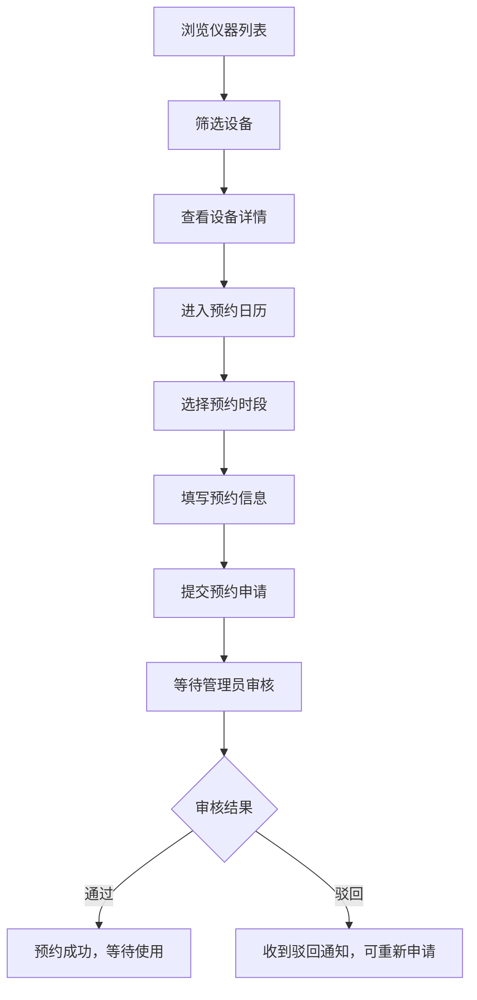
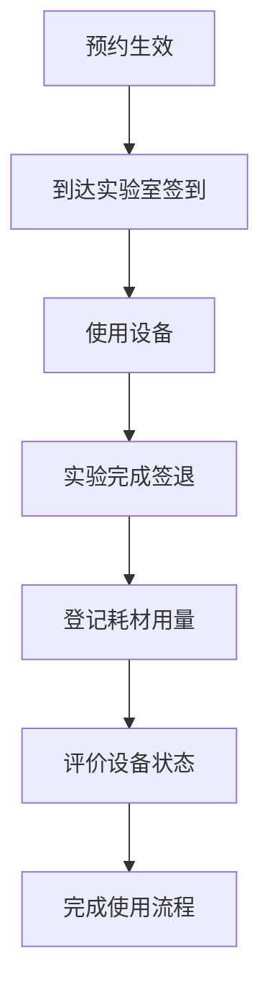
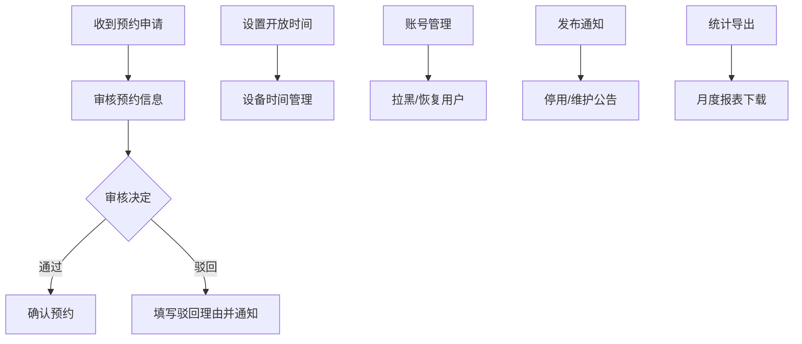

## 1. 产品概述

实验室预约 Web 应用是面向高校师生的共享仪器与实验空间预约管理平台，旨在提高实验室设备利用率，规范预约流程，降低管理成本。

- **核心价值**：实现仪器设备的线上预约、使用追踪与耗材管理，提升实验室运营效率
- **目标用户**：高校教师、学生、实验室管理员
- **使用场景**：科研实验、课程实验、设备共享、耗材管理

## 2. 核心功能

### 2.1 用户角色

| 角色 | 注册方式 | 核心权限 |
|------|----------|----------|
| 普通用户（师生） | 工号/学号注册 | 浏览仪器、预约设备、查看使用记录、登记耗材、评价设备 |
| 管理员 | 后台分配 | 审核预约、管理设备、设置开放时间、拉黑账号、发布通知、导出统计 |

### 2.2 功能模块

1. **仪器列表页**：筛选浏览、设备详情、操作说明、安全要求
2. **预约日历页**：日历视图、时段选择、预约提交、时段修改、预约取消
3. **使用记录页**：签到签退、设备评价、实验目的上传
4. **耗材登记页**：耗材列表、用量登记、领用记录
5. **管理员审核页**：预约审核、开放时间设置、账号管理、停用通知、统计导出

### 2.3 页面详情

| 页面名称 | 模块名称 | 功能描述 |
|----------|----------|----------|
| 仪器列表页 | 筛选区 | 按院系、设备类型、空闲时段筛选 |
| 仪器列表页 | 设备卡片 | 展示设备名称、状态、位置、图片 |
| 仪器列表页 | 设备详情弹窗 | 操作说明、安全要求、技术参数、预约入口 |
| 预约日历页 | 日历视图 | 月/周视图切换，展示已预约时段 |
| 预约日历页 | 时段选择 | 可拖拽选择预约时段，显示占用情况 |
| 预约日历页 | 预约表单 | 填写实验目的、参与人员、备注 |
| 使用记录页 | 记录列表 | 展示历史预约记录及状态 |
| 使用记录页 | 签到签退 | 扫码/按钮签到签退，记录实际使用时长 |
| 使用记录页 | 设备评价 | 星级评分、状态反馈、问题描述 |
| 耗材登记页 | 耗材列表 | 展示可领用耗材及库存 |
| 耗材登记页 | 用量登记 | 选择耗材、填写用量、关联预约 |
| 耗材登记页 | 领用记录 | 历史耗材领用记录查询 |
| 管理员审核页 | 待审列表 | 展示待审核预约申请 |
| 管理员审核页 | 审核操作 | 通过/驳回预约，填写审核意见 |
| 管理员审核页 | 时间设置 | 设置设备开放时间、节假日闭馆 |
| 管理员审核页 | 账号管理 | 拉黑/恢复违规账号 |
| 管理员审核页 | 通知发布 | 发布设备停用/维护通知 |
| 管理员审核页 | 统计导出 | 导出月度使用统计报表 |

## 3. 核心流程

### 3.1 用户预约流程

用户进入仪器列表页，通过筛选条件找到目标设备，查看设备详情与操作说明，确认后进入预约日历页选择可用时段，填写实验目的与相关信息后提交预约申请，等待管理员审核。

### 3.2 使用与评价流程

预约生效后，用户在约定时间到达实验室签到，使用设备完成实验后签退，登记耗材使用量，并对设备状态进行评价反馈。

### 3.3 管理员审核流程

管理员收到预约申请后，审核预约信息的合理性与设备可用性，决定通过或驳回，可设置设备开放时间，管理用户账号，发布通知，并定期导出使用统计。

## 4. 用户界面设计

### 4.1 设计风格

- **设计定位**：专业科技风，体现科研实验室的严谨与现代感
- **主色调**：深蓝科技蓝 (#165DFF)，代表专业与可信
- **辅助色**：青绿 (#00B42A) 成功状态、橙红 (#FF7D00) 警告状态、红色 (#F53F3F) 错误状态
- **背景色**：浅灰蓝渐变背景，营造清爽科技氛围
- **按钮风格**：圆角矩形按钮，悬停有微缩放与阴影效果
- **字体**：标题使用现代无衬线字体，正文清晰易读
- **布局风格**：卡片式布局，顶部导航 + 侧边导航双模式
- **图标风格**：线性图标，简约科技感

### 4.2 页面设计概览

| 页面名称 | 模块名称 | UI元素 |
|----------|----------|--------|
| 仪器列表页 | 顶部筛选栏 | 下拉筛选器、搜索框、状态标签组 |
| 仪器列表页 | 设备卡片网格 | 图片、名称、位置、状态标签、预约按钮 |
| 仪器列表页 | 详情弹窗 | 标签页切换（参数/说明/安全）、预约入口 |
| 预约日历页 | 日历头部 | 月份切换、视图切换、设备选择 |
| 预约日历页 | 日历网格 | 时段色块、悬停预览、点击选择 |
| 预约日历页 | 预约表单侧栏 | 表单输入、时段确认、提交按钮 |
| 使用记录页 | 状态标签栏 | 全部/待使用/使用中/已完成筛选 |
| 使用记录页 | 记录卡片 | 设备名、时段、状态、操作按钮组 |
| 使用记录页 | 评价弹窗 | 星级评分、状态选择、文本反馈 |
| 耗材登记页 | 耗材列表 | 分类筛选、库存显示、领用按钮 |
| 耗材登记页 | 登记表单 | 数量选择、关联预约、提交登记 |
| 管理员审核页 | 侧边菜单 | 审核列表/时间设置/账号管理等入口 |
| 管理员审核页 | 数据表格 | 预约信息、操作按钮、状态标签 |
| 管理员审核页 | 统计卡片 | 使用率、预约量、耗材用量等指标 |

### 4.3 响应式

- 采用桌面优先设计，适配平板与移动端
- 移动端将侧边导航转为底部 Tab 栏
- 表格在小屏幕下转为卡片式展示
- 日历视图在移动端简化为日视图

### 4.4 动效设计

- 页面切换采用淡入滑入过渡效果
- 卡片悬停有轻微上浮与阴影加深
- 按钮点击有缩放反馈
- 状态变更有颜色渐变动画
- 日历时段选择有高亮扩散效果
