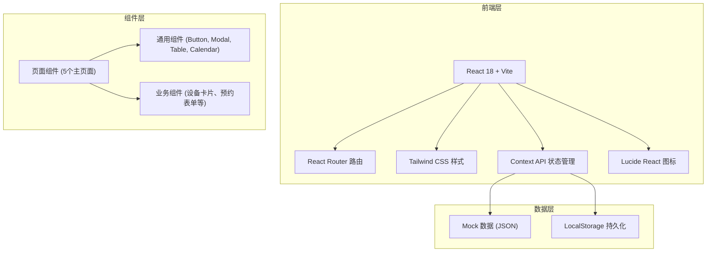
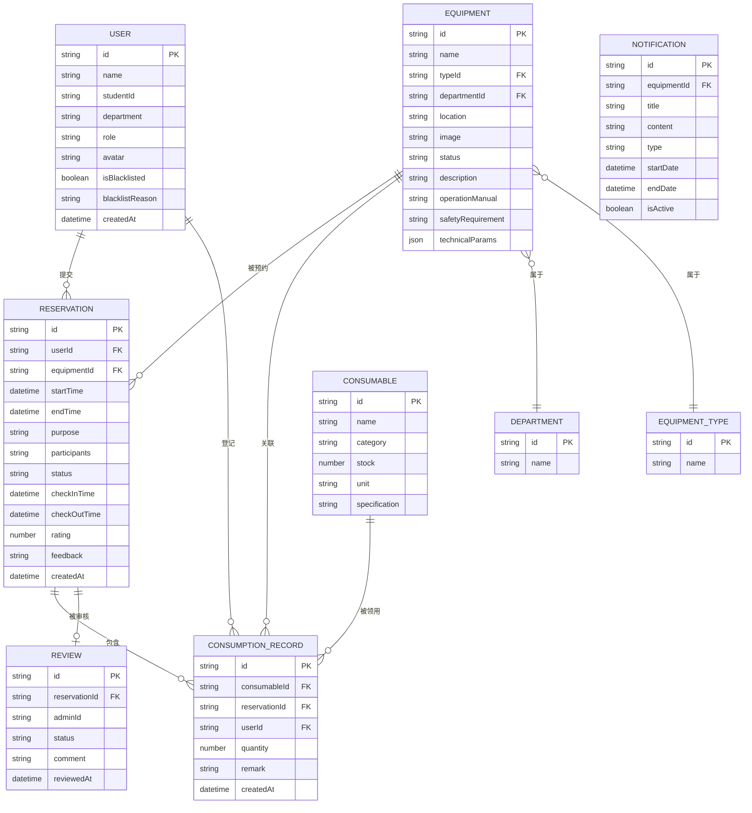

## 1. 架构设计



## 2. 技术描述

- **前端框架**：React 18 + TypeScript
- **构建工具**：Vite 5
- **样式方案**：Tailwind CSS 3
- **路由管理**：React Router v6
- **状态管理**：React Context + useReducer
- **图标库**：Lucide React
- **日期处理**：date-fns
- **数据存储**：LocalStorage + Mock 数据
- **代码规范**：ESLint + Prettier

## 3. 路由定义

| 路由 | 页面 | 说明 |
|------|------|------|
| / | 仪器列表页 | 首页，展示所有可预约仪器 |
| /calendar | 预约日历页 | 日历视图，选择时段预约 |
| /records | 使用记录页 | 历史预约记录、签到签退、评价 |
| /consumables | 耗材登记页 | 耗材列表、用量登记、领用记录 |
| /admin | 管理员审核页 | 审核、设置、管理、统计 |

## 4. 数据模型

### 4.1 数据模型定义



### 4.2 数据初始化

系统预置 Mock 数据，包含：
- 3 个院系（物理学院、化学学院、生命科学学院）
- 5 种设备类型（显微镜、光谱仪、离心机、PCR仪、色谱仪）
- 15 台仪器设备
- 10 种耗材
- 10 条预约记录
- 2 个用户角色（普通用户、管理员）

## 5. 核心模块说明

### 5.1 通用组件

| 组件名 | 功能说明 |
|--------|----------|
| Layout | 整体布局，包含侧边栏和顶部导航 |
| Button | 通用按钮组件，支持多种状态和尺寸 |
| Modal | 弹窗组件，支持标题、内容、底部操作 |
| Table | 数据表格组件，支持排序、分页 |
| Tabs | 标签页切换组件 |
| Badge | 状态标签组件 |
| Calendar | 日历组件，支持月/周视图 |
| Select | 下拉选择组件 |
| Input | 输入框组件 |
| Rating | 星级评分组件 |

### 5.2 状态管理

使用 React Context + useReducer 管理全局状态：
- AuthContext：用户登录状态、角色信息
- EquipmentContext：仪器设备数据、筛选状态
- ReservationContext：预约记录、预约操作
- ConsumableContext：耗材数据、领用记录
- AdminContext：管理员操作数据

### 5.3 工具函数

- dateUtils：日期格式化、时段计算、工作日判断
- storageUtils：LocalStorage 读写封装
- mockData：Mock 数据生成与初始化
- validators：表单验证函数

## 6. 目录结构

```
src/
├── components/          # 通用组件
│   ├── Layout/
│   ├── Button/
│   ├── Modal/
│   ├── Table/
│   ├── Calendar/
│   └── ...
├── pages/              # 页面组件
│   ├── EquipmentList/
│   ├── Calendar/
│   ├── Records/
│   ├── Consumables/
│   └── Admin/
├── context/            # 状态管理
│   ├── AuthContext.tsx
│   ├── EquipmentContext.tsx
│   ├── ReservationContext.tsx
│   └── ...
├── data/               # Mock 数据
│   ├── equipments.ts
│   ├── reservations.ts
│   ├── consumables.ts
│   └── users.ts
├── types/              # TypeScript 类型定义
│   └── index.ts
├── utils/              # 工具函数
│   ├── date.ts
│   ├── storage.ts
│   └── validators.ts
├── App.tsx
├── main.tsx
└── index.css
```
